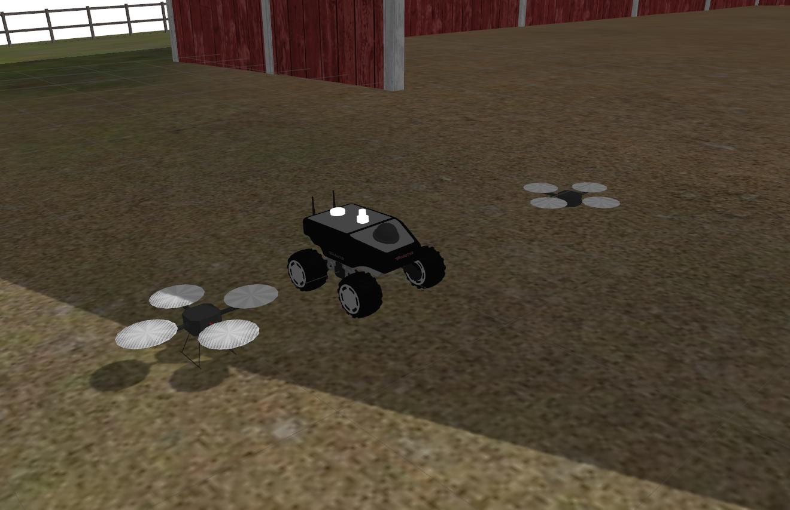

# Multi Robot Simulation

Repository to simulate a team of robots on a map in Gazebo. Team can be up to 4 UAV HectorQuadcopter and 3 UGV

---



## Installation

Please mind the ROS distro when downloading git repos.

* Clone this repo to the src/ folder in your catkin Workspace

```
cd ~/catkin_ws/src
git clone https://gitlab.ensta.fr/ssh/multi-robot.git
```
* Clone [hector_quadrotor](https://github.com/tu-darmstadt-ros-pkg/hector_quadrotor) repo to get the dependencies to quadcopters models :

```
git clone https://github.com/tu-darmstadt-ros-pkg/hector_quadrotor.git
```
* Define your path to install the packages with rosinstall (replace {distro} with your ROS distro, are whatever path your want) :

```
rosinstall . /opt/ros/{distro}/
```
* Source the newly created setup.bash file in your catkin workspace :

```
source /home/toralba/catkin_ws/src/setup.bash
```
* Use the rosinstall file provided by hector_quadrotor to install all the mandatory packages :

```
rosinstall . hector_quadrotor/hector_quadrotor.rosinstall
```
* re-source your setup.bash file (to be confirmed) :

```
source /home/toralba/catkin_ws/src/setup.bash
```

Before getting the dependencies, install all the mandatory packages to use the Summit XL rover model :
* Clone repos for Summit XL simulation and its own dependencies :

```
git clone https://github.com/RobotnikAutomation/summit_xl_common.git
git clone https://github.com/RobotnikAutomation/robotnik_msgs.git
git clone https://github.com/RobotnikAutomation/robotnik_sensors.git
git clone https://github.com/RobotnikAutomation/summit_xl_sim.git
```
* Add outdoor agricultural, inspection and indoor office simulation worlds for Gazebo :

```
git clone https://github.com/clearpathrobotics/cpr_gazebo.git
```

* Finally, get all the dependencies with rosdep and compile the new packages : 

```
cd ..
rosdep install --from-paths src --ignore-src -r -y
catkin_make
```

---

## Usage

### Launch a simulation with 

`roslaunch multi_robot team.launch`

Feel free to create your own launch file

### Performance

In the bottom of the GUI of Gazebo, a real time factor is displayed, if it's not equal to 1, your computer is not strong enough to handle the load. You could also switch to a headless simulation on a remote server.

## Tutorial

Package based on the tutorial

[YouTube](https://www.youtube.com/watch?v=mFTkN5v4Jzc)

[YouTube](https://www.youtube.com/watch?v=es_rQmlgndQ)

[YouTube](https://www.youtube.com/watch?v=KjxHQLQ0tiE)

[ROS Answer](https://answers.ros.org/question/41433/multiple-robots-simulation-and-navigation/)